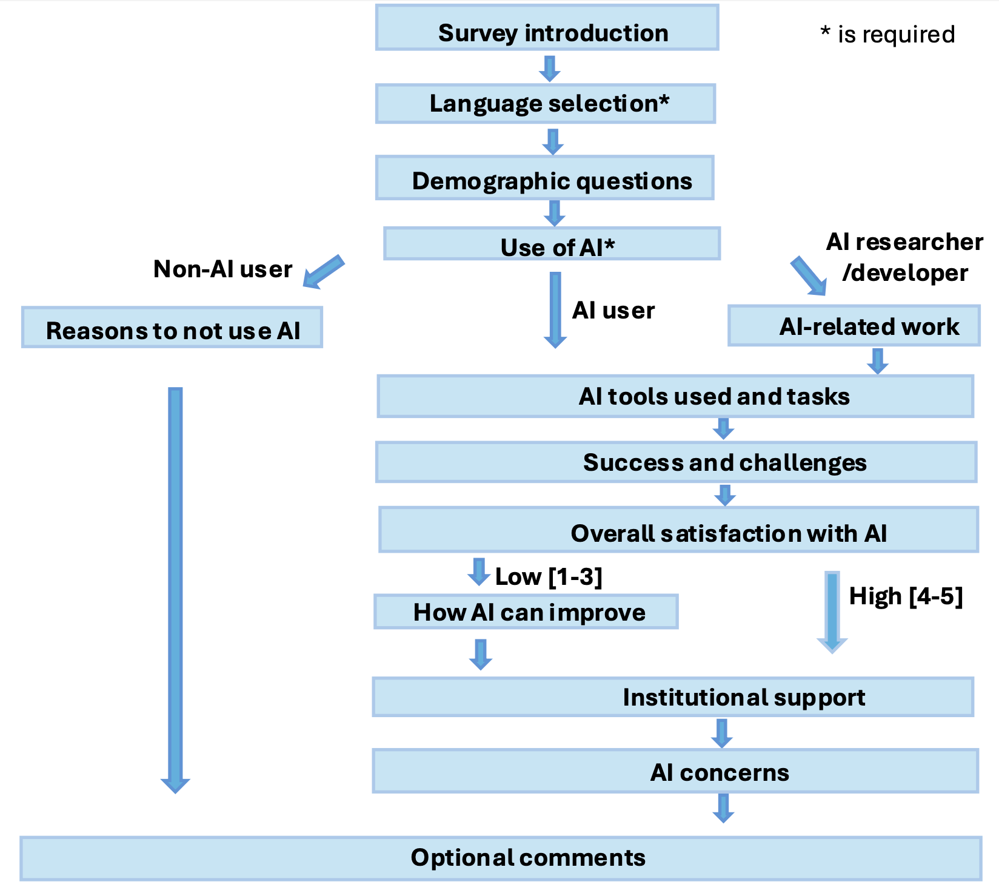
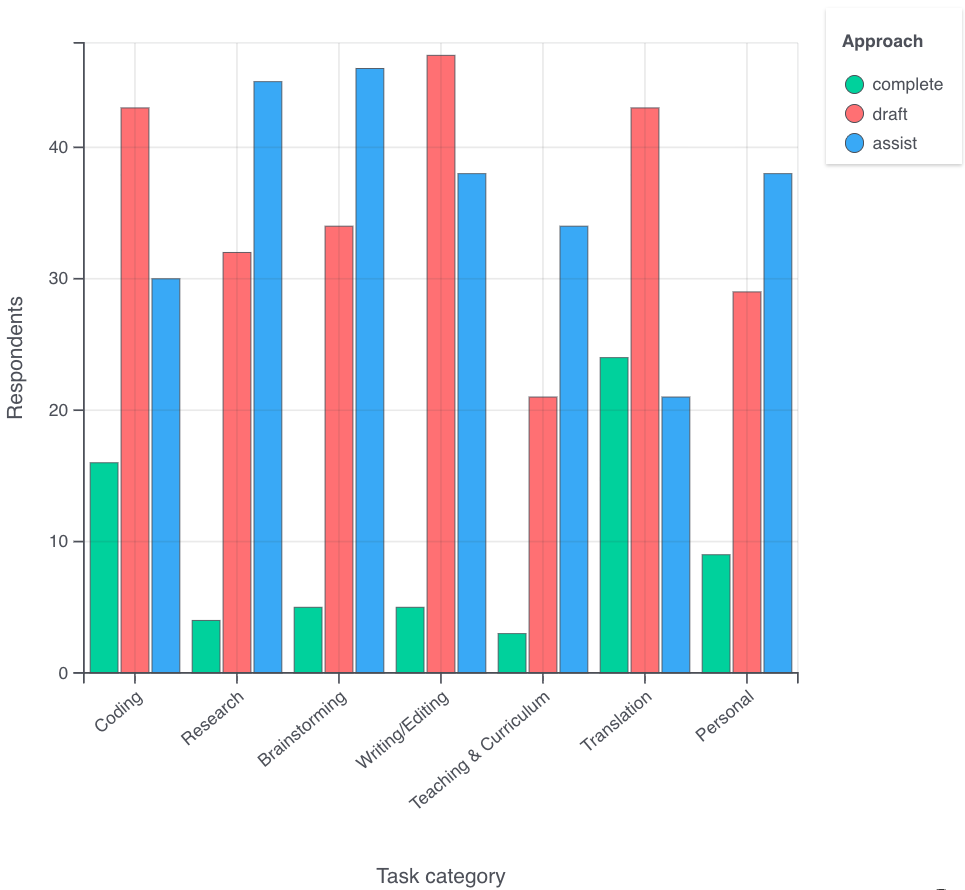

## Introduction
The rapid adoption of AI in life sciences and bioinformatics has created both opportunities and challenges for researchers, making it important to understand how AI is currently used in these communities. To address this, we created a survey that centers on Biohackathon participants, but also reaches members of the broader bioinformatics community through participants’ networks, capturing practices beyond the event itself. The survey gathers insights into the AI tools being used, the successes achieved, and the challenges faced, while also inviting participants to briefly review their current work to enable proper documentation and citation. We aim to gauge the current state of AI usage, highlight successes and challenges, and build a community-driven knowledge base to inform future AI development. By surveying attendees and their networks across diverse backgrounds (including Thai, Japanese, and English-speaking participants), we document AI usage, workflows, and challenges, providing a snapshot of current practices in the global bioinformatics community. Ultimately, this effort seeks to create a shared resource that both records ongoing AI research and fosters collaboration across the international life sciences community.

## Survey design and development

The survey originated from community discussions at the Biohackathon, where participants identified the need to better understand how AI is being adopted, applied, and critically evaluated within the life sciences and bioinformatics. The aim was not only to document current practices but also to create a shared knowledge base that could support the broader bioinformatics community.
The design process emphasized inclusivity, accessibility, and clarity. The survey was made available in English, Japanese, and Thai to accommodate linguistic diversity among participants and their extended networks. The survey was also sent to other interested parties whose language we decided not to address because the majority of these people speaks at least one of the other languages. To ensure a common starting point, a definition of “AI” was provided at the beginning of the survey, covering both general-purpose tools (e.g., LLMs) and domain-specific applications (e.g., for sequencing or structural biology). To balance brevity with sufficient depth, the questionnaire was designed to be completed in approximately 10–15 minutes, while still collecting meaningful information about participants’ experiences and perspectives.
The survey differentiated between three groups of respondents—AI users, non-users, and active AI researchers or developers—by branching the questionnaire so that participants only answered questions relevant to their background and level of engagement. Only the survey language and participants’ self-reported “best use of AI” were required, as these answers determined subsequent question pathways.
The final survey are structured around 8 key themes: (1) demographics, (2) general usage and reasons for non-use, (3) researcher or developer contributions, (4) applications and impacts, (5) failures and “horror stories,” (6) institutional support, (7) ethical concerns, and (8) final thoughts. Question types included a mix of closed-ended (multiple choice, Likert scale) and open-ended items, enabling both structured responses and free-text reflections. Open-ended prompts were particularly intended to capture nuanced perspectives on reliability, verification of AI outputs, and broader impacts of AI on research, education, and workforce practices.
To streamline data collection and encourage engagement, the survey emphasized confidentiality, voluntary participation, and privacy safeguards. For example, only institution type (rather than institution name) and work country (rather than country of origin) were collected, ensuring anonymity while still allowing contextual interpretation of responses. Participants were also invited to share brief descriptions of their projects, prior work, or relevant references, helping to build a community-driven catalog of active AI research in bioinformatics.
By combining quantitative questions with qualitative reflections, the survey was designed to capture both concrete technical details (e.g., tools and workflows) and higher-level considerations such as societal impacts, ethical concerns, and organizational support. This multi-faceted approach aimed to generate a comprehensive snapshot of AI usage, challenges, and opportunities in bioinformatics, providing both immediate insights for the Biohackathon community and a resource for the wider international field.
The survey schema is presented in Figure 1. 

Figure 1: Survey schema

### Implementation Challenges
The development and deployment of the survey faced several practical challenges. A key consideration was translation and localization, as the survey was offered in English, Japanese, and Thai, requiring careful adaptation of terminology to maintain clarity and cultural relevance. While responses were collected in multiple languages, analysis was ultimately conducted in English, necessitating careful translation back to preserve nuance and accuracy. Crafting inclusive demographic questions, particularly regarding age, gender, and field of work, posed additional complexity, as the goal was to balance sensitivity with the need for meaningful data. The survey also had to accommodate multiple objectives: capturing general patterns of AI usage while also allowing space for active researchers to share citations and contributions. On the technical side, form branching and accessibility required testing to ensure participants were directed to relevant questions without confusion. Finally, encouraging strong participation demanded proactive strategies, including leveraging participants’ bioinformatics networks at their institutions to circulate the survey more widely.

## Results
### Respondents' demographic
The survey captured responses from 105 participants with excellent response rates across demographic categories. About half of the surveys were conducted in English, about one-third in Japanese, and the rest was in Thai (Figure 2). The respondent pool demonstrated distinct geographic, professional, and demographic characteristics that contextualize the AI usage findings. 

The sample showed strong Asia-Pacific representation (68.7%, n=68), with Japan (44.4%, n=44) and Thailand (23.2%, n=23) comprising two-thirds of respondents (Figure 3). European participants represented 22.2% (n=22), led by Germany (9.1%, n=9), while North American participation was limited (4.0%, n=4). This geographic concentration reflects the survey's distribution through BioHackathon networks, particularly the 2025 Japan event. This geographic concentration reflects the survey's distribution through BioHackathon networks, particularly the 2025 Japan event. Importantly, this distribution offers a valuable counterbalance to the majority of existing surveys and research in this field, which are often dominated by North American or Western European perspectives. By capturing insights from Asia-Pacific stakeholders, this survey provides a distinct and complementary viewpoint that broadens the global discourse and contributes perspectives that are often underrepresented in the literature.

The majority of respondents were affiliated with academic institutions (n=73), complemented by representation from the public sector (n=17) and private sector (n=19) (Figure 4). Several participants reported holding multiple affiliations, underscoring cross-sector collaboration. This distribution reflects the inherently academic character of BioHackathon and its networks, while also showing meaningful engagement from the private sector. The disciplinary spread further highlighted the event’s multidisciplinary nature, with respondents frequently citing overlapping specializations in genomics, bioinformatics, machine learning, data visualization, and software development.

The sample skewed toward mid-career professionals (n=58), with 36 respondents aged 35–44 and 22 aged 45–54. Early-career participants were also well represented (n=35), including 29 in the 25–34 age group and 9 under 25 years old (Figure 5). Gender distribution showed 67.3% men (n=70), 26.9% women (n=28), 1.9% non-binary individuals (n=2), and 3.8% who preferred not to answer (n=4) (Figure 6). While gender imbalance persists, the distribution broadly reflects trends in the bioinformatics community and shows a more balanced representation than typically seen among BioHackathon participants, where over 80% are men. 

Two-thirds of respondents (66.3%, n=69) reported prior involvement in BioHackathon, including half of the total sample (50.0%, n=52) who participated in the 2025 Japan event (Figure 7). More than a quarter (26.9%, n=28) were first-time participants, reflecting successful community expansion. At the same time, over one-third (33.7%, n=35) had not attended a BioHackathon, ensuring that perspectives extended beyond the immediate network.

These demographic patterns indicate the survey captured a geographically concentrated but professionally diverse scientific community, with strong representation from computational biology and bioinformatics fields. The Asia-Pacific focus and academic orientation provide important context for interpreting AI adoption patterns and usage preferences in this specialized research community.

Respondents reported expertise spanning a wide range of domains, with the strongest representation in genomics and transcriptomics (n=50), sequence analysis (n=36), and data standards and interoperability (n=34) (Figure 8). Substantial engagement was also seen in database management (n=32), data visualization (n=28), and machine learning and AI (n=28), reflecting both biological and computational emphases. Other fields, such as metagenomics and microbiome informatics, medical/clinical informatics, and HPC and cloud bioinformatics, were also represented, while more specialized areas, including chemoinformatics, drug discovery and nanomedicine, and research software engineering, had fewer participants. Overall, the distribution highlights the multidisciplinary breadth of the community, combining traditional bioinformatics domains with emerging computational and translational fields.

### AI usage and AI tools

The survey results on AI usage distribution show that 10 people are AI developers and researchers, 92 people are AI users and one is not an AI-user. Among the AI-users, the majority of respondents (61) reported using AI everyday, while another 23 use it a few times a week, and 8 use it a few times a month (Figure 9). Overall, this indicates that most participants are frequent AI users, with only a small minority not engaging with AI tools.

There is only one person in the survey who reported not using AI, and the reason was a lack of trust in both the companies developing AI and the results generated by the underlying technology, alongside concerns about the environmental impact of AI training and usage. While this represents a single perspective, it highlights that beyond technical performance, issues of trust, transparency, and sustainability can still act as barriers to adoption.

Participants reported using AI across several areas. Data infrastructure and interoperability includes integrating databases and knowledge graphs with LLMs, as well as converting dataset descriptions into RDF for life sciences (BioHackathon 2024; OSF preprint). Data annotation and enrichment efforts range from semi-automatic annotation pipelines in microbiology to microbial trait prediction for database expansion (Nat. Commun. Biol. 2025). AI is also applied to biological function, specifically protein function prediction (Nat. Mach. Intell. 2024). A major theme is health and health care,  spanning prognosis of diabetic kidney disease (link), epidemiological and biological data analysis (Comput. Biol. Med. 2024), and AI architectures supporting mental health care (link). Lastly, some participants focus on method development and benchmarking, including AI agents for science, deep learning for data analysis, and establishing standards for ML/AI applications.

A recent exploration of AI tool usage reveals that ChatGPT is the most mentioned tool (56), followed by Gemini (25) and Claude (9) (Figure 10, Table 1). The table includes GitHub Copilot, DeepL, and various others, each receiving fewer answers. This pattern underscores ChatGPT’s dominant position in the community while also reflecting growing diversification in AI tool adoption. 

We conducted a survey to examine how AI is used across seven types of tasks—Coding, Research, Brainstorming, Writing/Editing, Teaching & Curriculum, Translation, and Personal—with responses categorized into three usage types: assist, draft, and complete. “Assist” represents using AI for a specific part of a task; “draft” represents AI making the first draft, which the respondent would edit and finalize; “complete” means AI making the complete product with little to no edit after. 

Across task categories, respondents most often used AI to assist with work (blue), such as supporting research, brainstorming, and writing/editing. Drafting with AI and then editing (red) was also common, especially for translation, writing, and personal tasks. Fully completing tasks with AI (green) was far less frequent overall, though translation and personal use cases showed relatively higher adoption of this mode. This pattern indicates that participants primarily view AI as a collaborative aid rather than a tool for full task automation (Figure 11).  

To filter by Country, Age, and Gender, you can check the following link.  
[Tasks and How They Use AI: Filterable Bar Chart](https://yukikonoda.github.io/ai-survey/#)

#### Key takeaways from the data
- Overall, the use of **“assist” (partial support)** is the most common.
For example: Research (45), Brainstorming (46), Writing/Editing (38), Personal (38).
- “**Draft” (first draft generation)** is also frequently chosen,
especially for Writing/Editing (47) and Translation (43).
- **“Complete” (fully automated use)** is less common overall.
Translation (24) and Coding (16) are relatively higher, but for Research (4), Brainstorming (5), and Teaching (3), the counts remain very low.

### AI successes 

From the 80 success cases reported, several recurring themes emerged:
Coding and Database Support (21 cases): Participants frequently used AI for generating, debugging, or assisting in coding tasks, as well as database management.

Efficiency and Time-Saving (18 cases): Many highlighted that AI accelerated routine tasks and shortened project timelines.
Proposal and Document Writing (8 cases): AI was utilized to draft, refine, and structure research proposals and other academic documents.
Data Analysis and Curation (8 cases): AI-supported sample curation, dataset preparation, and preliminary analysis tasks.

Agreements and Contracts (3 cases): AI facilitated comparison or drafting of agreements, such as Material Transfer Agreements.
Survey respondents reported diverse success cases of AI usage, with the majority emphasizing assistance in coding/database tasks and efficiency improvements. Other noted benefits included proposal writing, data curation, and support with agreements. Overall, AI shows an undeniable ability to accelerate work and reduce the effort required for technical and administrative tasks.

### AI challenges & "failures"

Survey Question:
"When using AI tools in your work, what challenges have you faced? (Select all that apply)"
We analyzed responses from 105 participants based on the following multiple-choice question items (multiple answers allowed):
- AI tools are too complex or not user-friendly
- AI outputs are inaccurate or unreliable
- AI suggestions are difficult to interpret
- Difficulty integrating AI into existing workflows
- Lack of institutional support (software, hardware, guidance)
- High computational cost / resources required
- Data limitations (size, quality, accessibility)
- Ethical or privacy concerns
- Over-reliance on AI leading to mistakes
- Other

Note that responses categorized as “Other” were excluded from the graphs, but they mentioned issues such as lack of training or support, network restrictions, unclear usage instructions, high learning costs, and concerns about reliability or privacy.

#### Regional patterns in AI-related concerns
Across all examined regions, common concerns regarding the use of artificial intelligence (AI) emerged (Figure 12.1). Specifically, issues related to the accuracy and reliability of AI systems, the risk of over-reliance leading to human error, and ethical and privacy considerations were consistently reported as the most prominent concerns. These patterns were observed regardless of differences in sample size across regions, indicating their global relevance.

When considering regional characteristics alongside sample sizes, distinct patterns were observed (Figure 12.2). English-speaking regions reported the highest absolute number of concerns. This likely reflects their comparatively high adoption rates of AI technologies, suggesting that their respondents may have more extensive experience with the challenges of AI integration. In contrast, Japan showed a notable emphasis on data-related limitations—including data size, quality, and accessibility. This pattern may reflect specific regulatory frameworks or cultural practices surrounding data management that are unique to Japan. Meanwhile, Thailand exhibited lower absolute counts but maintained similar proportional patterns to the other regions, suggesting that despite differences in sample size, the fundamental nature of concerns remains consistent.

A proportional analysis of responses further supports this view: when considering relative frequencies rather than raw counts, all three regions displayed similar priority rankings of concerns. This suggests that many challenges associated with AI adoption are universal in nature, transcending regional and cultural boundaries.

Lastly, some issues received consistently low levels of concern across all regions. In particular, the complexity of user interfaces and the interpretability of AI-generated suggestions were rarely identified as primary barriers. This implies that the key challenges to broader AI adoption are perceived to lie in technical reliability rather than usability, regardless of cultural context.

You can view the graphs at the following link: AI Survey – Challenges

### AI failures
Reported AI Failures

A total of 105 participants responded to the survey question:
“Tell us about a time AI really failed you or caused unexpected trouble. What happened, and what did you learn?”

Their responses were analyzed qualitatively, and the main themes are summarized below.

- Prompting & Instruction Issues
Several respondents reported that poorly constructed prompts often resulted in incorrect or irrelevant outputs. They noted that effective use of AI requires sufficient domain knowledge to craft appropriate prompts and to critically evaluate the generated results.

- Accuracy & Hallucination
A recurring issue was AI producing confidently incorrect answers, including hallucinated references and inconsistent results. Participants highlighted the risk of trusting AI outputs without verification.

- Code Generation Problems
Respondents using AI for programming frequently experienced non-functional code, breaking changes, and outdated syntax. This hindered productivity and sometimes introduced new errors into their projects.

- Context & Reasoning Issues
Many participants reported that AI forgets earlier context, contradicts itself, and struggles with long or multi-step reasoning tasks, especially when handling extended texts.

- Positive Experiences
A subset of respondents reported no major failures, particularly when they used AI cautiously and maintained realistic expectations. These users tended to cross-check results before applying them.

Key Insights

- This analysis suggests that AI failures primarily stem from fundamental limitations in reasoning, context retention, and output reliability.

- The most commonly reported problems were: hallucination,poor prompting, and technical inaccuracies.

- Conversely, users who approached AI cautiously and with appropriate expectations encountered fewer problems, highlighting the importance of critical oversight and domain expertise when using AI tools.

### Overall satisfaction with AI & AI improvement

### Institution support
#### Kind of AI supports
### Perceptions of AI-related Harms
### Additional comments

## Conclusion
The survey provides a comprehensive snapshot of AI usage, successes, and challenges within the bioinformatics community, particularly among Biohackathon participants and their networks. Key findings include the widespread adoption of AI tools like ChatGPT for coding assistance and efficiency improvements, alongside significant concerns about accuracy, reliability, and ethical considerations. The demographic analysis highlights a geographically concentrated but professionally diverse respondent pool, with strong representation from Asia-Pacific regions.

# Discussion

...

## Acknowledgements

...

## References