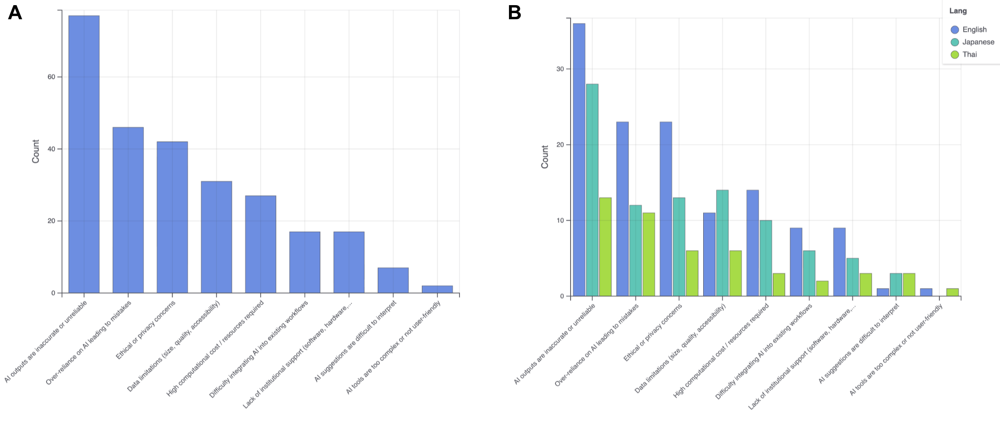

## Abstract
Understanding the practical application of artificial intelligence (AI) in research is increasingly important as it becomes embedded in life sciences and bioinformatics. This paper reports on a multilingual survey, developed through community discussions at the 2025 BioHackathon in Japan and distributed through its networks, to capture current practices, successes, and challenges in AI adoption. The survey, offered in English, Japanese, and Thai, received 105 responses spanning diverse demographics, regions, and professional backgrounds. Findings reveal that most participants are frequent AI users, with tools like ChatGPT, Gemini, and Claude widely adopted, with ChatGPT as number one response. AI is primarily used to assist or draft tasks in coding, research, and writing, while full task automation remains uncommon, reflecting a preference for AI as a collaborative aid rather than a replacement. Successes were noted in efficiency, coding support, and proposal writing, whereas challenges centered on accuracy and reliability. Institutional support emerged as a key factor: respondents in Japan, Thailand, and the private sector reported stronger support and higher satisfaction than English-speaking or academic counterparts. By documenting real-world practices and concerns, this survey provides a valuable community-driven resource to guide responsible AI development and foster international collaboration in bioinformatics.

## Introduction
The rapid adoption of AI in life sciences and bioinformatics has created both opportunities and challenges for researchers, making it important to understand how AI is currently used in these communities. Beyond technical innovation, AI is increasingly becoming part of everyday research workflows, influencing how data is processed, interpreted, and shared. At the same time, its integration raises broad questions about reliability, accessibility, and practical use that are relevant across the field. Recent large-scale analyses, such as evidence from millions of Claude conversations on economic tasks [@citesAsEvidence:Handa2025], and domain-specific explorations of LLM use in bioinformatics settings like WildBio [@citesForInformation:Steinberg2024], highlight the growing need to document and understand how AI is deployed in practice.

While our study centers on Biohackathon participants, the survey also reaches members of the broader bioinformatics community through participants’ networks, capturing practices beyond the event itself. The survey gathers insights into the AI tools being used, the successes achieved, and the challenges faced, while also inviting participants to briefly review their current work to enable proper documentation and citation. We aim to gauge the current state of AI usage, highlight successes and challenges, and build a community-driven knowledge base to inform future AI development. By surveying attendees and their networks across diverse backgrounds (including Thai, Japanese, and English-speaking participants), we document AI usage, workflows, and challenges, providing a snapshot of current practices in the global bioinformatics community. Ultimately, this effort seeks to create a shared resource that both records ongoing AI research and fosters collaboration across the international life sciences community.

## Materials and Methods
### Survey Design and Development

The survey originated from community discussions at the Biohackathon, where participants identified the need to better understand how AI is being adopted, applied, and critically evaluated within the life sciences and bioinformatics. The aim was not only to document current practices but also to create a shared knowledge base that could support the broader bioinformatics community.

The design process emphasized inclusivity, accessibility, and clarity. The survey was made available in English, Japanese, and Thai to accommodate linguistic diversity among participants and their extended networks. To ensure a common starting point, a definition of "AI" was provided at the beginning of the survey, covering both general-purpose tools (e.g., LLMs) and domain-specific applications (e.g., for sequencing or structural biology). To balance brevity with sufficient depth, the questionnaire was designed to be completed in approximately 10–15 minutes, while still collecting meaningful information about participants’ experiences and perspectives.

The survey differentiated between three groups of respondents: AI users, non-users, and active AI researchers or developers, by branching the questionnaire so that participants only answered questions relevant to their background and level of engagement. Only the survey language and participants’ self-reported "best use of AI" were required, as these answers determined subsequent question pathways.

The final survey are structured around 8 key themes: (1) demographics, (2) general usage and reasons for non-use, (3) researcher or developer contributions, (4) applications and impacts, (5) failures and "horror stories", (6) institutional support, (7) ethical concerns, and (8) final thoughts/optional comments. Question types included a mix of closed-ended (multiple choice, Likert scale) and open-ended items, enabling both structured responses and free-text reflections. Open-ended prompts were particularly intended to capture nuanced perspectives on reliability, verification of AI outputs, and broader impacts of AI on research, education, and workforce practices.

To streamline data collection and encourage engagement, the survey emphasized confidentiality, voluntary participation, and privacy safeguards. For example, only institution type (rather than institution name) and work country (rather than country of origin) were collected, ensuring anonymity while still allowing contextual interpretation of responses. Participants were also invited to share brief descriptions of their projects, prior work, or relevant references, helping to build a community-driven catalog of active AI research in bioinformatics.

By combining quantitative questions with qualitative reflections, the survey was designed to capture both concrete technical details (e.g., tools and workflows) and higher-level considerations such as societal impacts, ethical concerns, and organizational support. This multi-faceted approach aimed to generate a comprehensive snapshot of AI usage, challenges, and opportunities in bioinformatics, providing both immediate insights for the Biohackathon community and a resource for the wider international field.

The survey schema is presented in Figure 1.

### Implementation Challenges
The development and deployment of the survey faced several practical challenges. A key consideration was translation and localization, as the survey was offered in English, Japanese, and Thai, requiring careful adaptation of terminology to maintain clarity and cultural relevance. While responses were collected in multiple languages, analysis was ultimately conducted in English, necessitating careful translation back to preserve nuance and accuracy. Crafting inclusive demographic questions, particularly regarding age, gender, and field of work, posed additional complexity, as the goal was to balance sensitivity with the need for meaningful data. The survey also had to accommodate multiple objectives: capturing general patterns of AI usage while also allowing space for active researchers to share citations and contributions. On the technical side, form branching and accessibility required testing to ensure participants were directed to relevant questions without confusion. Finally, encouraging strong participation demanded proactive strategies, including leveraging participants’ bioinformatics networks at their institutions to circulate the survey more widely.

## Results
### Respondents' demographic
The survey captured responses from 105 participants with excellent response rates across demographic categories. About half of the surveys were conducted in English, about one-third in Japanese, and the rest was in Thai (Figure 2). The respondent pool demonstrated distinct geographic, professional, and demographic characteristics that contextualize the AI usage findings. 

The sample showed strong Asia-Pacific representation (68.7%, n=68), with Japan (44.4%, n=44) and Thailand (23.2%, n=23) comprising two-thirds of respondents (Figure 3). European participants represented 22.2% (n=22), led by Germany (9.1%, n=9), while North American participation was limited (4.0%, n=4). This geographic concentration reflects the survey's distribution through BioHackathon networks, particularly the 2025 Japan event. Importantly, this distribution offers a valuable counterbalance to the majority of existing surveys and research in this field, which are often dominated by North American or Western European perspectives. By capturing insights from Asia-Pacific stakeholders, this survey provides a distinct and complementary viewpoint that broadens the global discourse and contributes perspectives that are often underrepresented in the literature.

The majority of respondents were affiliated with academic institutions (n=73), complemented by representation from the public sector (n=17) and private sector (n=19) (Figure 4). Several participants reported holding multiple affiliations, underscoring cross-sector collaboration. This distribution reflects the inherently academic character of BioHackathon and its networks, while also showing meaningful engagement from the private sector. The disciplinary spread further highlighted the event’s multidisciplinary nature, with respondents frequently citing overlapping specializations in genomics, bioinformatics, machine learning, data visualization, and software development.

The sample skewed toward mid-career professionals (n=58), with 36 respondents aged 35–44 and 22 aged 45–54. Early-career participants were also well represented (n=35), including 29 in the 25–34 age group and 9 under 25 years old (Figure 5). Gender distribution showed 67.3% men (n=70), 26.9% women (n=28), 1.9% non-binary individuals (n=2), and 3.8% who preferred not to answer (n=4) (Figure 6). While gender imbalance persists, the distribution broadly reflects trends in the bioinformatics community and shows a more balanced representation than typically seen among BioHackathon participants, where over 80% are men.

Two-thirds of respondents (66.3%, n=69) reported prior involvement in BioHackathon, including half of the total sample (50.0%, n=52) who participated in the 2025 Japan event (Figure 7). More than a quarter (26.9%, n=28) were first-time participants, reflecting successful community expansion. At the same time, over one-third (33.7%, n=35) had not attended a BioHackathon, ensuring that perspectives extended beyond the immediate network.

These demographic patterns indicate the survey captured a geographically concentrated but professionally diverse scientific community. The Asia-Pacific focus and academic orientation provide important context for interpreting AI adoption patterns and usage preferences in this specialized research community.

Respondents reported expertise spanning a wide range of domains, with the strongest representation in genomics and transcriptomics (n=50), sequence analysis (n=36), and data standards and interoperability (n=34) (Figure 8). Substantial engagement was also seen in database management (n=32), data visualization (n=28), and machine learning and AI (n=28), reflecting both biological and computational emphases. Other fields, such as metagenomics and microbiome informatics, medical/clinical informatics, and HPC and cloud bioinformatics, were also represented, while more specialized areas, including chemoinformatics, drug discovery and nanomedicine, and research software engineering, had fewer participants. Overall, the distribution highlights the multidisciplinary breadth of the community, combining traditional bioinformatics domains with emerging computational and translational fields.

### AI usage and AI tools

The survey results on AI usage distribution show that 10 people are AI developers and researchers, 92 people are AI users and one is not an AI-user. Among the AI-users, the majority of respondents (61) reported using AI everyday, while another 23 use it a few times a week, and 8 use it a few times a month (Figure 9). Overall, this indicates that most participants are frequent AI users, with only a small minority not engaging with AI tools.

There is only one person in the survey who reported not using AI, and the reason was a lack of trust in both the companies developing AI and the results generated by the underlying technology, alongside concerns about the environmental impact of AI training and usage. While this represents a single perspective, it highlights that beyond technical performance, issues of trust, transparency, and sustainability can still act as barriers to adoption.

Participants reported using AI across several areas. Data infrastructure and interoperability includes integrating databases and knowledge graphs with LLMs, as well as converting dataset descriptions into RDF for life sciences [@citesAsEvidence:Steinberg2024]. Data annotation and enrichment efforts range from semi-automatic annotation pipelines in microbiology to microbial trait prediction for database expansion [@citesAsEvidence:Koblitz2025]. AI is also applied to biological function, specifically protein function prediction [@citesAsEvidence:Kulmanov2024] A major theme is health and health care,  spanning prognosis of diabetic kidney disease, epidemiological and biological data analysis [@citesAsEvidence:Chida2025], and AI architectures supporting mental health care. Lastly, some participants focus on method development and benchmarking, including AI agents for science, deep learning for data analysis, and establishing standards for ML/AI applications.

A recent exploration of AI tool usage reveals that ChatGPT is the most mentioned tool (56), followed by Gemini (25) and Claude (9) (Figure 10, Table 1). The table includes GitHub Copilot, DeepL, and various others, each receiving fewer answers. This pattern underscores ChatGPT’s dominant position in the community while also reflecting growing diversification in AI tool adoption (Figure 10).

We conducted a survey to examine how AI is used across seven types of tasks: Coding, Research, Brainstorming, Writing/Editing, Teaching & Curriculum, Translation, and Personal use, with responses categorized into three usage types: assist, draft, and complete. “Assist” represents using AI for a specific part of a task; “draft” represents AI making the first draft, which the respondent would edit and finalize, and “complete” means AI making the complete product with little to no edit after. Across task categories, respondents most often used AI to assist with work (red), such as supporting research, brainstorming, and writing/editing. Drafting with AI and then editing (blue) was also common, especially for translation, writing, and personal tasks. Fully completing tasks with AI (green) was far less frequent overall, though translation and personal use cases showed relatively higher adoption of this mode. This pattern indicates that participants primarily view AI as a collaborative aid rather than a tool for full task automation (Figure 11 and interactive visualized on [https://yukikonoda.github.io/ai-survey](https://yukikonoda.github.io/ai-survey).  

### Successes cases of AI usage

From the 80 success cases reported, several recurring themes emerged:
Coding and Database Support (21 cases): Participants frequently used AI for generating, debugging, or assisting in coding tasks, as well as database management.
- Efficiency and Time-Saving (18 cases): Many highlighted that AI accelerated routine tasks and shortened project timelines.
- Proposal and Document Writing (8 cases): AI was utilized to draft, refine, and structure research proposals and other academic documents.
- Data Analysis and Curation (8 cases): AI-supported sample curation, dataset preparation, and preliminary analysis tasks.
- Agreements and Contracts (3 cases): AI facilitated comparison or drafting of agreements, such as Material Transfer Agreements.

Survey respondents reported diverse success cases of AI usage, with the majority emphasizing assistance in coding/database tasks and efficiency improvements. Other noted benefits included proposal writing, data curation, and support with agreements. Overall, AI shows an undeniable ability to accelerate work and reduce the effort required for technical and administrative tasks.

### AI challenges
Across all examined regions, common concerns regarding the use of artificial intelligence (AI) emerged (Figure 12a). Specifically, issues related to the accuracy and reliability of AI systems, the risk of over-reliance leading to human error, and ethical and privacy considerations were consistently reported as the most prominent concerns. These patterns were observed regardless of differences in sample size across regions, indicating their global relevance.

When considering regional characteristics alongside sample sizes, distinct patterns were observed (Figure 12b). English-speaking regions reported the highest absolute number of concerns. This likely reflects their comparatively high adoption rates of AI technologies, suggesting that their respondents may have more extensive experience with the challenges of AI integration. In contrast, Japan showed a notable emphasis on data-related limitations, including data size, quality, and accessibility. This pattern may reflect specific regulatory frameworks or cultural practices surrounding data management that are unique to Japan. Meanwhile, Thailand exhibited lower absolute counts but maintained similar proportional patterns to the other regions, suggesting that despite differences in sample size, the fundamental nature of concerns remains consistent.

A proportional analysis of responses further supports this view: when considering relative frequencies rather than raw counts, all three regions displayed similar priority rankings of concerns. This suggests that many challenges associated with AI adoption are universal in nature, transcending regional and cultural boundaries.

Lastly, some issues received consistently low levels of concern across all regions. In particular, the complexity of user interfaces and the interpretability of AI-generated suggestions were rarely identified as primary barriers. This implies that the key challenges to broader AI adoption are perceived to lie in technical reliability rather than usability, regardless of cultural context.

### AI failures
A total of 105 participants responded to the survey question: "Tell us about a time AI really failed you or caused unexpected trouble. What happened, and what did you learn?""

Their responses were analyzed qualitatively, and the main themes are summarized below.

- Prompting & Instruction Issues
Several respondents reported that poorly constructed prompts often resulted in incorrect or irrelevant outputs. They noted that effective use of AI requires sufficient domain knowledge to craft appropriate prompts and to critically evaluate the generated results.

- Accuracy & Hallucination
A recurring issue was AI producing confidently incorrect answers, including hallucinated references and inconsistent results. Participants highlighted the risk of trusting AI outputs without verification.

- Code Generation Problems
Respondents using AI for programming frequently experienced non-functional code, breaking changes, and outdated syntax. This hindered productivity and sometimes introduced new errors into their projects.

- Context & Reasoning Issues
Many participants reported that AI forgets earlier context, contradicts itself, and struggles with long or multi-step reasoning tasks, especially when handling extended texts.

- Positive Experiences
A subset of respondents reported no major failures, particularly when they used AI cautiously and maintained realistic expectations. These users tended to cross-check results before applying them.

This analysis suggests that AI failures primarily stem from fundamental limitations in reasoning, context retention, and output reliability. The most commonly reported problems were: hallucination,poor prompting, and technical inaccuracies. Conversely, users who approached AI cautiously and with appropriate expectations encountered fewer problems, highlighting the importance of critical oversight and domain expertise when using AI tools.

### Overall satisfaction with AI & AI improvement
Figure 13 shows the distribution of overall satisfaction ratings from respondents. The mean score is 3.73 with the majority of participants rating their satisfaction as 4 (about 50 percent). Both ratings 3 and 5 had a notable share (~24% and <20%, respectively). Fewer respondents selected lower ratings. Overall, this indicates that most respondents reported high satisfaction, clustering toward the upper end of the scale.

The cross-tabulation in Figure 14 shows clear differences in satisfaction across language groups. Japanese speakers reported the highest satisfaction (mean score 4.03), with the majority rating 4 or 5 and very few low scores. Thai speakers also leaned strongly toward higher ratings, mostly at 4 and 5, though with a smaller sample size (mean score 3.90). In contrast, English speakers showed a wider spread across ratings, with more responses at 3 and fewer at the top end (mean score 3.43). Overall, both Japanese and Thai respondents expressed higher satisfaction compared to English respondents.

Among unsatisfied users, four main areas were identified for improvement in AI tools, with accuracy and reliability standing out as the top concern (36.84 %) (Figure 15). This is followed by privacy, security, and ethics (23.68 %) and control and customization (19.73%), and usability and efficiency (11.84%). Other issues such as sustainability, reproducibility, energy consumption, and model performance were also mentioned. Overall, the findings highlight that trustworthiness, ethical handling, and user control are the most critical priorities for increasing satisfaction.

### Institution support
Japanese and Thai speakers indicate a better institutional support than English speakers, with 50% (Thai) to 54% (Japanese) of the respondents indicating a good or very good support (4 to 5 on the scale) while roughly the same proportion of English speakers (51.2%) only indicate an average or better support (3 to 5 on the scale) (Figure 16).

Private Sector shows an overwhelming support compared to academia and public sector, with around 60% of the respondents indicating a very good support from their institution, compared to only 15.3% (Academia) to 26.7% (Public sector) of the respondents indicating the same level of support (Figure 17).

Workers of the EU, US and other countries indicate little to no support from their institutions (48.4% at 1 to 2 on the scale) compared to their counterparts in Japan (30.3% for the same score) or Thailand (13% for the same score) (Figure 18). The proportion of them indicating a very good support is also almost half (16.1%) of workers in Japan (27.9%) and Thailand (26.1%).

Respondents that indicated a good to very good institutional support level for AI usage (4-5) also tend to express a higher level of satisfaction with AI. While the distribution of satisfied to very satisfied respondents only account for 50% and a little more on average for those who indicated an insufficient to neutral level of institutional support (1-3), it jumps up to more than 80% for respondents with a good to very good institutional support (4-5) (Figure 19).

### Kind of AI support
Among the different types of support provided by institutions, the respondents indicated access to institutional AI software or platforms (licenses, subscriptions) and access to high-performance computing / GPU resources as the most commonly provided support (respectively 22% and 21.5% of responses). Then, at almost half the number of responses, there is provision of its own self-hosted AI services (11%), guidance on ethical use of AI / AI governance policies (10.5%), training/workshops on AI tools or prompt engineering (10%), funding or grants for AI-related projects (9.5%) and support for integrating AI into research workflows (8.1%). Dedicated AI support staff or help desk also gathered a few responses (4.3%), while financial assistance for AI-trained personnel and usage support / allowance gathered little to none (0.5% each) (Figure 20).

### Perceptions of AI-related Harms
To quantify public concern regarding ethical and societal issues related to AI. A survey of participants assessed the level of concern for five distinct areas: misinformation/hallucinations, bias in algorithms, data privacy/security, environment impact, and intellectual property/ownership. Respondents rated their concern on a scale from low (1) to high (5). A primary finding is the high level of concern regarding misinformation/hallucinations (mean score 4.19). This issue garnered the highest percentage of very concerned responses, with a majority of participants indicating a high level of concern (Scores 4-5, 52%). This suggests a prominent public apprehension about the potential for AI to generate and spread false or misleading information. Data privacy/security (mean score 3.45), intellectual property ownership (mean score 3.33), bias in algorithms (mean score 3.24) also emerged as areas of public concern. All three categories show a substantial proportion of participants rating their concern at levels 4 (59% and 42%, respectively). This indicates a strong public awareness about how personal data is used, the potential for discriminatory outcomes from AI systems, and the risks surrounding ownership and control of intellectual property generated or influenced by AI. Conversely, environment impact registered comparatively lower levels of concern (mean score 2.80. This suggests that while these are recognized as potential problems, they are not as predominantly at the forefront of public consciousness as the other four areas (Figure 21).

### Additional comments
There are over 20 free-text “final thoughts”/optional comments responses provided. Five participants expressed appreciation for the survey itself, highlighting interest and enthusiasm for the topic. These responses indicate a positive reception and engagement with the study.

The first major theme concerns societal, educational, and workforce impacts of AI, raised by 8 participants. Responses highlighted potential risks of over-reliance, especially among younger generations, including reduced engagement with programming, independent problem-solving, and critical thinking. Concerns about AI addiction and psychological effects were also noted. Broader implications were raised regarding labor relations, education, skill development and retention, and publishing, as well as organizational expectations and awareness around AI use. Participants additionally raised issues of equity and access, noting that disparities may arise based on who can afford AI services, highlighting potential inequalities in opportunities and participation. One participant also expressed concern about the hype surrounding AGI and its potential societal repercussions.

The second major theme relates to reliability, usefulness, and pace of AI tools, also raised by 8 participants. Responses emphasized that AI can be highly effective for well-defined tasks, but outputs must be carefully verified, particularly for specialized content. Participants noted specific challenges, including the risk of malware or hallucinated software libraries being distributed with seemingly positive reviews, and differences in AI accuracy depending on the language of queries, highlighting the need to carefully evaluate outputs. Participants also observed that the rapid emergence of new AI tools makes it challenging to identify which are most effective, particularly when some are behind paywalls or trial periods are short.

## Conclusion
This survey provides a timely snapshot of how AI is being used, perceived, and critically evaluated within the bioinformatics communities, particularly among participants connected to the BioHackathon network. The findings reveal a community that is actively engaging with AI tools, with most respondents using them frequently across a wide range of applications, from coding and data analysis to teaching and writing. Usage patterns, however, vary by task: AI is most often used to assist with work (e.g., research, brainstorming, and writing/editing), while drafting with AI and then editing is also common, particularly for translation, writing, and personal tasks. Fully automated use of AI to complete tasks is much less frequent, though translation and personal use show somewhat higher adoption. Overall, this pattern indicates that participants primarily view AI as a collaborative aid rather than a tool for full task automation. Successes are evident in areas such as efficiency gains, coding support, and research documentation, underscoring AI’s capacity to accelerate scientific workflows and reduce administrative burdens. At the same time, the results highlight recurring challenges around accuracy, reliability, and trust, reinforcing the need for continued refinement of both tools and workflows.

Differences across linguistic and regional groups also provide important context. Japanese and Thai respondents generally expressed higher satisfaction with AI tools compared to English-speaking participants, reflecting both cultural dynamics and stronger institutional support in these regions. Although the survey was translated into multiple languages primarily to ensure inclusivity, the results suggest that this inclusivity also revealed meaningful structural differences: participants in Japan and Thailand reported greater institutional backing, through resources, training, and governance, which appears to be linked to their higher satisfaction with AI itself. This regional focus is particularly valuable, as it reflects perspectives that might only surface in a BioHackathon hosted in Japan, offering insights that are often underrepresented in global surveys. Institutional backing more broadly emerged as a strong predictor of satisfaction, with respondents who reported better support also showing greater confidence in their AI use. This underscores the importance of community-driven capacity building, infrastructure investment, and ethical guidance alongside technical innovation in shaping the impact of AI.

Finally, the survey points to broader societal and ethical concerns that extend beyond immediate technical performance. Respondents expressed strong awareness of risks related to misinformation, data privacy, bias, and intellectual property, highlighting the importance of embedding responsible innovation practices in AI development and deployment. Free-text responses further warned of over-reliance among younger generations, with risks of reduced engagement in programming, problem-solving, and critical thinking, alongside concerns about AI addiction and psychological effects. While enthusiasm for AI is evident, participants stressed the need for critical oversight, equitable access, and careful evaluation of tools. Taken together, these insights position the survey as a valuable contribution to documenting global perspectives on AI in bioinformatics, while also offering guidance for fostering a responsible, collaborative, and sustainable path forward.

### Limitations
Despite these contributions, the study has limitations. The sample size (N=105) is modest and concentrated in Asia-Pacific, particularly Japan and Thailand, reflecting the BioHackathon network’s reach. While this offers underrepresented perspectives, it may not fully capture practices in North America, Western Europe, or other regions. In addition, respondents were largely drawn from a computationally skilled community, which may overrepresent AI adopters relative to the broader life sciences. As with all self-reported surveys, responses may also be subject to bias in how successes and failures were described. These factors should be considered when generalizing findings to the global bioinformatics landscape.

## Acknowledgement
We would like to thank Database Center for Life Science (DBCLS) for hosting the 2025 BioHackathon. We would also like to thank DBCLS and Hub of Talents for Thailand Bioinformatics Research Network for funding support for CW, PT, NS, PN. 

## References